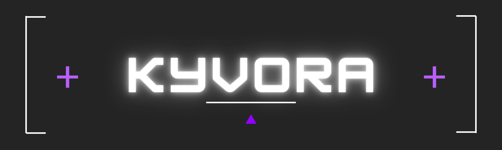

<div align="center">

<h1>Kyvora — Open-source Homelab Control Plane</h1>



<br />

An open-source Homelab Control Plane for managing, monitoring, and operating self-hosted infrastructure from one modern dashboard.

[Current version: 0.1.0](./VERSION)

[](#license)
[](#overview)
[](#overview)

[](https://github.com/hadzicni/kyvora/releases)
[](https://github.com/hadzicni/kyvora/stargazers)
[](https://github.com/hadzicni/kyvora/issues)
[](https://github.com/hadzicni/kyvora/commits)

<br />

[Quick Start](#installation) ·
[Features](#features) ·
[Usage](#usage) ·
[Contributing](#contributing)

</div>

## Table of Contents

- [Overview](#overview)
- [Tech Stack](#tech-stack)
- [Features](#features)
- [Prerequisites](#prerequisites)
- [Installation](#installation)
- [Configuration](#configuration)
- [Usage](#usage)
- [Development](#development)
- [Releases](#releases)
- [Build and Deployment](#build-and-deployment)
- [Security](#security)
- [Contributing](#contributing)
- [Maintainers](#maintainers)
- [Contact](#contact)
- [License](#license)

## Overview

Kyvora is an open-source Homelab Control Plane for managing self-hosted infrastructure from one dashboard.

It currently provides:

- a Spring Boot backend API with JWT authentication
- a Next.js web dashboard with Auth.js login sessions
- server inventory management with CRUD, search, filters, pagination, and detail pages
- agent registration and heartbeat tracking
- persistent audit logging for infrastructure changes
- dashboard summary metrics
- OpenAPI/Swagger documentation
- an initial Go-based Kyvora agent

Kyvora is built as a monorepo with a modular backend, a modern web UI, and a lightweight agent foundation.

## Tech Stack

| Category | Technology |
| --- | --- |
| Frontend | Next.js 16, React 19, TypeScript |
| UI | Tailwind CSS v4, shadcn/ui |
| Web Auth | Auth.js / NextAuth |
| Backend | Java 21, Spring Boot 4 |
| API Auth | JWT access tokens, refresh tokens |
| Database | PostgreSQL |
| Migrations | Flyway |
| Backend Persistence | Spring Data JPA |
| Agent | Go |
| Testing | JUnit, Spring Boot Test, Go test, ESLint |
| CI/CD | GitHub Actions |
| Local Infrastructure | Docker / Docker Compose |

## Features

- Web dashboard with dark-mode-first UI
- Auth.js login session for the web app
- JWT-secured backend API
- Server Inventory CRUD
- Server search, filtering, pagination, and detail pages
- Agent registration and heartbeat tracking
- Initial Go agent for local registration and heartbeats
- Dashboard summary metrics
- Persistent audit logs with recent activity
- OpenAPI/Swagger API documentation
- GitHub Actions CI for web, API, and agent checks

## Prerequisites

- Git
- Node.js 24+
- npm
- Java 21
- Gradle
- Go 1.26+
- Docker or a reachable PostgreSQL database

## Installation

### 1. Clone the repository

```bash
git clone https://github.com/hadzicni/kyvora.git
cd kyvora
```

### 2. Install dependencies


```bash
npm install
```

### 3. Start PostgreSQL

Run PostgreSQL locally or on a reachable host. The backend expects a PostgreSQL database named `kyvora` by default.

Example with Docker:

```bash
docker run --name kyvora-postgres \
  -e POSTGRES_DB=kyvora \
  -e POSTGRES_USER=kyvora \
  -e POSTGRES_PASSWORD=kyvora \
  -p 5432:5432 \
  -d postgres:18-alpine
```

### 4. Start the project

#### Start the web dashboard

```bash
npm run dev:web
```

#### Start the API server

```bash
npm run dev:api
```

#### Start the Go agent

Create or select a server inventory entry in the web UI, enroll an agent for
that server, then start the agent with the generated agent ID and token:

```bash
KYVORA_API_URL=http://localhost:8080 \
KYVORA_AGENT_ID=<agent-id> \
KYVORA_AGENT_TOKEN=<agent-token> \
npm run dev:agent
```

### Useful local URLs:

* Web dashboard: http://localhost:3000
* Login: http://localhost:3000/login
* API health: http://localhost:8080/actuator/health
* Swagger UI: http://localhost:8080/swagger-ui.html
* OpenAPI JSON: http://localhost:8080/v3/api-docs

### Local bootstrap login:

* Email: admin@kyvora.local
* Password: admin-password

## Configuration

The backend API uses JWT Bearer authentication. Access tokens are short-lived
and refresh tokens are stored server-side as SHA-256 hashes.

Required backend secret:

```env
KYVORA_JWT_SECRET=replace-with-at-least-32-random-characters
```

Optional token lifetime settings:

```env
KYVORA_JWT_ACCESS_TOKEN_TTL_SECONDS=900
KYVORA_REFRESH_TOKEN_TTL_SECONDS=2592000
```

For local development only, start the API with the `local` Spring profile to
bootstrap an admin user when the users table is empty:

```env
SPRING_PROFILES_ACTIVE=local
KYVORA_BOOTSTRAP_ADMIN_EMAIL=admin@kyvora.local
KYVORA_BOOTSTRAP_ADMIN_PASSWORD=admin-password
KYVORA_BOOTSTRAP_ADMIN_DISPLAY_NAME=Kyvora Admin
```

The bootstrap defaults are development-only. Do not use a weak JWT secret or
the default admin email/password in production.

Local web Auth.js configuration:

```env
AUTH_SECRET=
# Generate a local secret with: npx auth secret
AUTH_URL=http://localhost:3000
API_BASE_URL=http://localhost:8080
```

The web app uses Auth.js session cookies plus server-side proxy routes to talk
to the backend. Browser code should keep calling local `/api/...` routes and
must not store backend JWTs.

Local agent API configuration:

```env
KYVORA_API_URL=http://localhost:8080
KYVORA_AGENT_ID=<agent-id>
KYVORA_AGENT_TOKEN=<agent-token>
```

Create or register a server from the web dashboard, then enroll an agent for
that server to receive `KYVORA_AGENT_ID` and `KYVORA_AGENT_TOKEN`. Agent tokens
are shown only once. Do not commit tokens or store them in `NEXT_PUBLIC_*`
variables.

## Usage

Describe the main use cases or commands here.

```bash
# Example
npm run start
```

Example workflow:

1. Start the application
2. Provide data or input
3. Review the result

Login example:

```bash
curl -s http://localhost:8080/api/v1/auth/login \
  -H 'Content-Type: application/json' \
  -d '{"email":"admin@kyvora.local","password":"admin-password"}'
```

Use the returned access token with protected API endpoints:

```bash
curl http://localhost:8080/api/v1/servers \
  -H "Authorization: Bearer <token>"
```

When the access token expires, call `/api/v1/auth/refresh` with the refresh
token from the login response. Refresh tokens are rotated on use; store the
new refresh token returned by the refresh response.

The local bootstrap credentials above are development-only. Do not use the
default admin email or password in production.

## Agent Enrollment

Agent enrollment uses one-time plaintext tokens. Kyvora stores only token
hashes and authenticates heartbeats with the `X-Kyvora-Agent-Token` header.

1. Log in to the web dashboard.
2. Create or select an existing server inventory entry.
3. Enroll an agent for that server from Agents or the server detail page.
4. Copy the one-time token and generated run command.
5. Start the agent with `KYVORA_API_URL`, `KYVORA_AGENT_ID`, and
   `KYVORA_AGENT_TOKEN`.

The token is shown only once immediately after creation. Store it securely and
do not commit it to Git. Successful heartbeats update the assigned agent status
and the linked server status and last-seen timestamp.

Pending enrollments can be canceled before the agent connects. Canceling a
pending enrollment deletes the pending agent record, revokes the setup token,
and frees the server so a new agent can be enrolled later.

Agent tokens can be rotated from the server detail Agent Setup section. Rotation
returns a new one-time plaintext token and immediately invalidates the previous
token. Kyvora still stores only the SHA-256 token hash and never re-shows old
plaintext tokens after the setup dialog is closed.

Server operational status is managed by agent heartbeats and offline detection,
not manual editing. A server starts as `UNKNOWN`, becomes `ONLINE` when its
linked agent reports a heartbeat, and becomes `OFFLINE` when the backend has
not received a heartbeat recently.

Activity tracks lifecycle transitions such as enrollment, first connection,
token rotation, cancellation, and offline detection. Routine heartbeats update
status and last-seen timestamps without creating repeated Activity rows. Token
values, token hashes, authorization headers, and cookies are never logged.

## Development

Useful commands:

```bash
npm run dev:web
npm run dev:agent

npm run release:check

npm run lint -w apps/web
npm run build -w apps/web

gradle -p apps/api test

cd apps/agent
go test ./...
```

## Releases

Kyvora uses a single product version for the full monorepo. The root `VERSION`
file is the source of truth, versions follow SemVer, and release tags use
`v<version>`, for example `v0.1.0`.

Release metadata must stay aligned:

- `VERSION`
- `CHANGELOG.md`
- Git tag

Useful commands:

```bash
npm run release:prepare -- 0.1.0
npm run release:check
```

See [docs/RELEASE.md](./docs/RELEASE.md) for the full release checklist,
hotfix flow, and tag workflow.

## Build and Deployment

Describe the build process and the path to the target environment.

Example:

```bash
npm run build
```

If relevant, include:

- target environment
- release process
- container or cloud deployment
- manual follow-up steps

## Security

If you discover a security vulnerability, please do not open a public issue.

Instead, report it privately:

- Email: nikolahadzic7@icloud.com
- Maintainer: Nikola Hadzic

We will investigate and provide updates as quickly as possible.

### Supported Versions

| Version        | Supported |
| -------------- | --------- |
| Latest         | ✅        |
| Older versions | ❌        |

## Contributing

Contributions are welcome. A possible workflow:

1. Create a fork
2. Create a feature branch
3. Implement your changes
4. Run tests and linting
5. Open a pull request

If the project has its own rules, link to `CONTRIBUTING.md` here.

## Maintainers

<!-- Duplicate the <td> block for additional maintainers -->
<table>
	<tr>
		<td align="center" width="180">
			<a href="https://github.com/hadzicni">
			    
			    <br />
			    <strong>Nikola Hadzic</strong>
			</a>
			<br />
			Core maintainer
		</td>
	</tr>
</table>

## Contact

- Contact person: Nikola Hadzic
- Email: nikolahadzic7@icloud.com
- Project page: https://github.com/hadzicni/kyvora

## License

This project is licensed under the MIT License.

See [LICENSE](LICENSE) for details.
